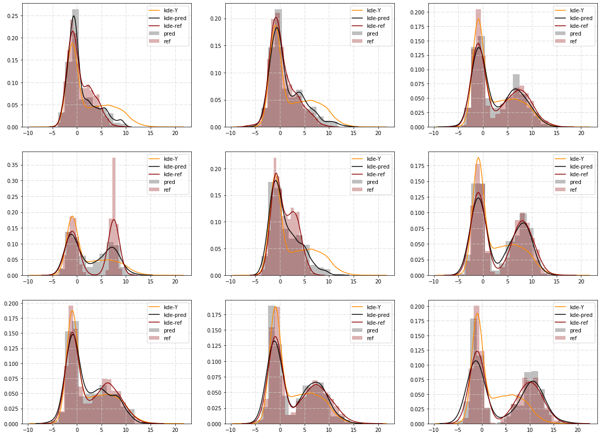

# Wasserstein-Random-Forests
A Random Forests-based conditional distribution estimator:

(X_i,Y_i; 1<= i <= n) + WRF estimate L(Y | X = x) for each x in Supp(X) given X ~ law(X) and Y | X = x ~ L(Y | X = x).




## Installation

**WassersteinRandomForest** is based on NumPy and Cython. So make sure these packages are installed using `pip`:

```
pip3 install setuptools numpy cython
```

The rest of the dependences will be automatically installed when building.


### Install from source:

Clone the git repository:
```
git clone https://github.com/MGIMM/Wasserstein-Random-Forests.git
```
Install with `pip`:

```
cd Wasserstein-Random-Forests
```
and
```
pip install .
```

### Jupyter notebook

If you do not want to install the package, an **All in one** jupyter notebook
is provided in `./notebook/All_in_one.ipynb`.


## Usage


```python
import numpy as np
from WassersteinRandomForests import WassersteinRandomForest  

# generate synthetic data
X = np.random.uniform(0,1,(1000,50))
Y = np.array([np.random.normal(2.*X[i,0],2.*X[i,1],1) for i in
range(1000)]).reshape(1000,)

reg = WassersteinRandomForest(nodesize = 2, # upper bound of the leaves 
                              bootstrap = False, # bootstrap 
                              subsample = 200, # when subsample <= 1, subsample is the resampling rate; when subsample >1, sumbsample = number of sample points for each tree 
                              n_estimators = 100, # number of decision trees
                              mtry = 40, # max features used for splitting
                              #n_jobs = 2, # currently unavailable
                              p = 2) # order of Wasserstein distance
reg.fit(X,Y)

# predict conditional expectation on a new point

reg.predict(X = np.random.uniform(0,1,(1,50)))

# predict conditional distribution on a new point

Y,W = reg.predict_distribution(X = np.random.uniform(0,1,(1,50)))

# The final output is the weighted empirical measure Y*W.

```

A generic example with visulization is provided in `./test/test.py`.

## Remarks

* The computational costs of Wasserstein Random Forests are slightly higher than
  the Breiman's Random Forests (O(n) vs O(nlogn) for the splitting where n denote the number of data points at current node). 
  In order to balance the performance and training time, the size of sample points `subsample` should be relatively small. In practice, one can
  choose `subsample` such that each tree is constructed with 200 to 500 data points.

* Currently, the package only provides an `cython` accelaration for the splitting
  mechanism. The tree construction and prediction are still implemented with raw
  python code. At the moment, I do not have time and ability to provide a fully optimized version.

## Reference

Wasserstein Random Forests at first glance. \[[pdf](https://mgimm.github.io/doc/wrf-try.pdf)\]
